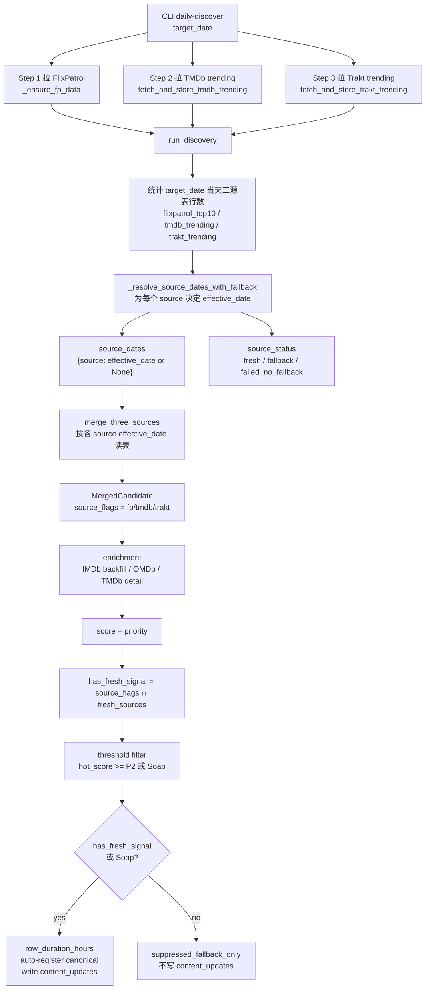
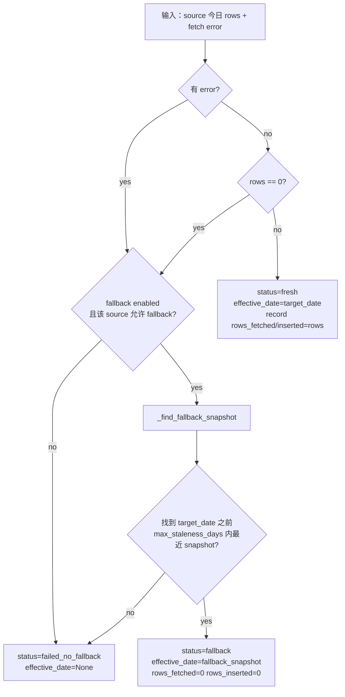
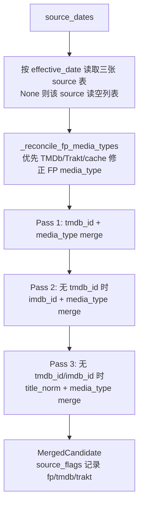
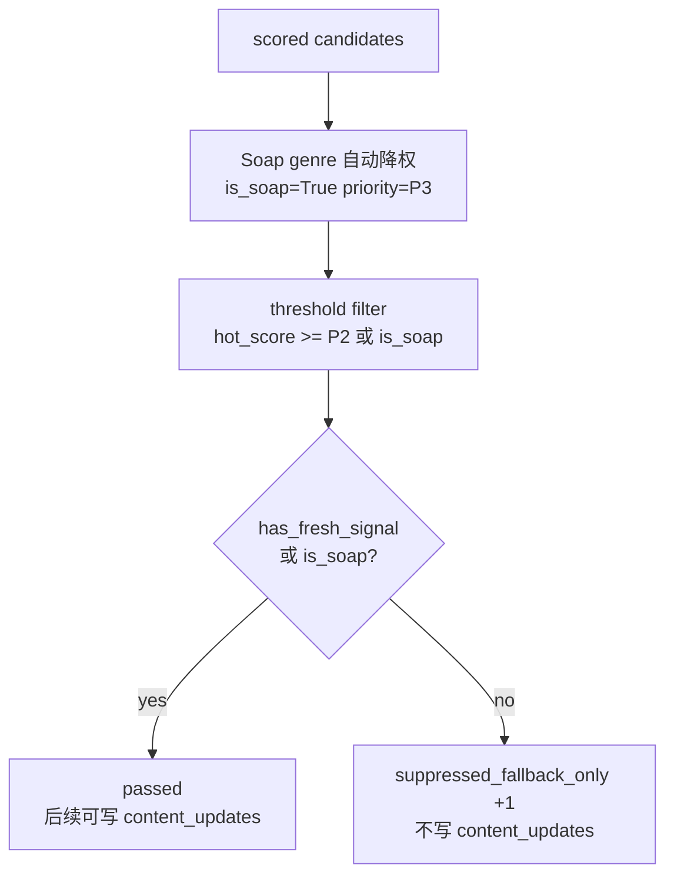
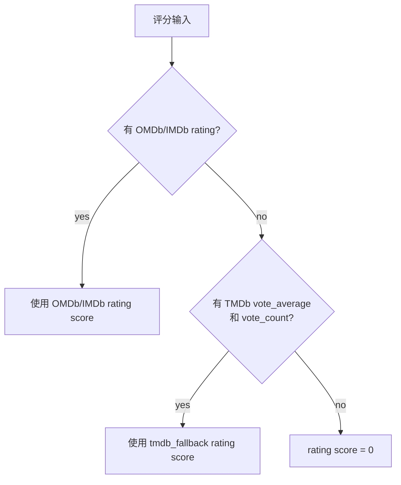
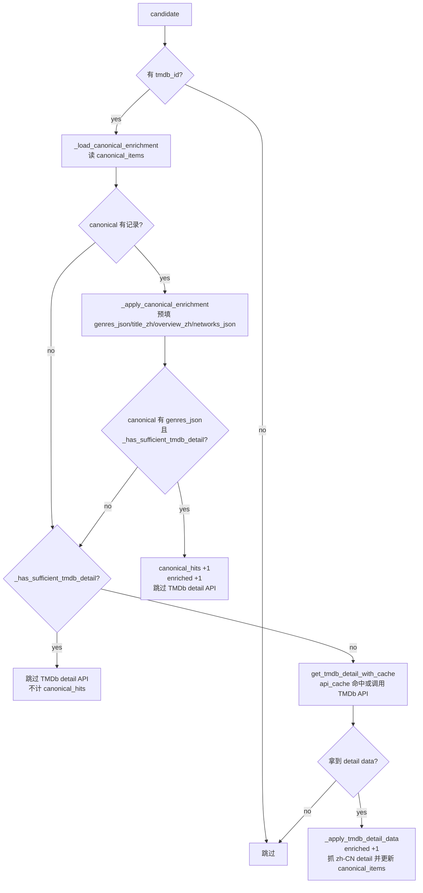

# Current Fallback Logic Map

> 日期：2026-05-23
> 范围：当前 `daily-discover` 主链路里，FlixPatrol / TMDb / Trakt 的 source 日期回退、merge fallback、rating fallback、TMDb detail skip 逻辑。本文描述“现在代码长什么样”，不是目标重构方案。

## 一句话产品语义

每日发现允许用历史 source snapshot 保持 pipeline 可运行；但“纯历史快照候选”不应被当成今日新发现写入 `content_updates`。如果一个候选至少有一个今日 fresh source 命中，则可以把其他历史 source 当补充上下文使用。

## 总览图



注意：当前实现里 `enrichment` 在 `has_fresh_signal` 过滤之前执行。因此 pure fallback 候选最终不会写入，但在被压制前已经可能参与 IMDb / OMDb / TMDb detail enrichment。

## Source 日期回退

当前函数：`src/movietrace/pipeline/discovery.py::_resolve_source_dates_with_fallback`

对 `flixpatrol`、`tmdb`、`trakt` 每个 source 独立跑同一套判断。



`_find_fallback_snapshot` 当前规则：

- 只找 `snapshot_date < target_date` 的历史数据。
- 只找 `snapshot_date >= target_date - max_staleness_days` 的数据。
- 取最近一天。
- source 到表的映射：
  - `flixpatrol` -> `flixpatrol_top10`
  - `tmdb` -> `tmdb_trending`
  - `trakt` -> `trakt_trending`

## Source 状态到产品含义

| status | effective_date | 产品含义 | 后续是否参与 merge |
|---|---|---|---|
| `fresh` | `target_date` | 今天这个 source 有可用数据 | 参与 |
| `fallback` | 历史 snapshot date | 今天不可用，用历史快照补上下文 | 参与 |
| `failed_no_fallback` | `None` | 今天不可用，也没有可用历史快照 | 不参与 |

`source_fallback_used` 当前只要任一 source 的 `effective_date != target_date` 且非空，就为 true。

## Merge fallback

当前函数：`src/movietrace/pipeline/multi_source_merge.py::merge_three_sources`

这里的 fallback 不是 source 日期回退，而是候选去重时的 ID fallback。



当前 merge key 顺序：

| 顺序 | key | 语义 |
|---|---|---|
| 1 | `tmdb:{tmdb_id}:{media_type}` | 最可信 |
| 2 | `imdb:{imdb_id}:{media_type}` | ID fallback |
| 3 | `title:{normalized_title}:{media_type}` | title fallback |

当前 candidate 只记录 `source_flags`，不记录每个 source 的 effective_date。后续 `has_fresh_signal` 是用 `source_flags` 和 `fresh_sources` 交叉计算出来的。

## Fresh signal 与写入门禁

当前位置：`src/movietrace/pipeline/discovery.py::run_discovery`

```python
fresh_sources = {s for s, d in source_dates.items() if d == snapshot_date}
has_fresh_signal = bool(candidate.source_flags & fresh_sources)
```

写入前逻辑：



产品上可以这样理解：

| 候选来源组合 | has_fresh_signal | 当前结果 |
|---|---:|---|
| 只来自今日 FP | true | 可作为今日候选 |
| 今日 FP + 昨日 TMDb fallback | true | 可作为今日候选，TMDb 作为补充上下文 |
| 只来自昨日 TMDb fallback | false | 评分后被压制，不写今日事件 |
| 昨日 TMDb fallback + 昨日 Trakt fallback | false | 评分后被压制，不写今日事件 |
| source 全部 failed_no_fallback | false / 无候选 | 无该 source 输入 |

## Rating fallback

当前位置：`src/movietrace/pipeline/scoring.py`

这是评分 fallback，不是 source 日期 fallback。



产品含义：没有 IMDb/OMDb 评分时，用 TMDb 评分兜底，避免评分维度完全为 0。它不影响 source 是否 fresh，也不决定能不能写今日事件。

## TMDb detail / canonical skip

当前位置：`src/movietrace/pipeline/omdb_enrichment.py::enrich_with_tmdb_details`



`_has_sufficient_tmdb_detail` 当前规则：

| media_type | 必要字段 |
|---|---|
| movie | `release_date` + `original_language` |
| tv | `release_date` + `original_language` + `last_air_date` |

注意：canonical enrichment 只预填中文、类型、平台等持久字段；只有候选已经满足 `_has_sufficient_tmdb_detail` 时，才允许因为 canonical 命中而跳过 detail API。

## 当前最容易误读的点

1. CLI 第 1-3 步说“拉取成功/失败”，但真正决定 source 使用哪天数据的是 `run_discovery` 里的 source fallback resolution。
2. `fallback` 有三种含义：source 日期回退、merge ID fallback、rating fallback。
3. pure fallback candidate 当前不会写 `content_updates`，但会先经过 enrichment 和 scoring。
4. `snapshot_date` 在 candidate / content_update 里是批次日，不等于每个 source 的真实 snapshot date。
5. `source_status` 里 fallback 的 `cached_count` 是 fallback snapshot 的行数；CLI Step 5 里展示的 `fp/tmdb/trakt rows` 仍主要来自 fetch result，和实际 rows used 不是完全同一个口径。

## 代码入口速查

| 逻辑 | 文件 / 函数 |
|---|---|
| CLI 三源抓取顺序 | `src/movietrace/cli.py::cmd_daily_discover` |
| FP 抓取和缓存复用 | `src/movietrace/pipeline/discovery.py::_ensure_fp_data` |
| source 日期回退 | `src/movietrace/pipeline/discovery.py::_resolve_source_dates_with_fallback` |
| 查历史 snapshot | `src/movietrace/pipeline/discovery.py::_find_fallback_snapshot` |
| 三源合并 | `src/movietrace/pipeline/multi_source_merge.py::merge_three_sources` |
| fresh signal / suppress pure fallback | `src/movietrace/pipeline/discovery.py::run_discovery` |
| rating fallback | `src/movietrace/pipeline/scoring.py` |
| TMDb detail skip | `src/movietrace/pipeline/omdb_enrichment.py::enrich_with_tmdb_details` |
